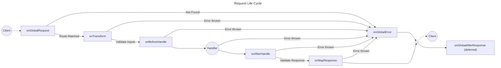

# Zeta

[](https://jsr.io/@aklinker1/zeta) [](https://jsr.io/@aklinker1/zeta) [](https://jsr.io/@aklinker1/zeta/doc) [](https://github.com/aklinker1/zeta/blob/main/LICENSE) [](https://github.com/aklinker1/zeta/blob/main/CHANGELOG.md)

Personal alternative to [Elysia](https://elysiajs.com/) with better validation support.

**Features**

- ✅ Standard schema support (Zod, Arktype, Valibot, etc)
- 🧩 Composable apps, plugins, and routes
- 🤖 Type-safe server and client side code
- ❄️ WinterCG compatible
- 🧪 Easy to test
- 📄 OpenAPI docs built-in

## Quick Start

Create a file `index.ts` and add the following code:

```ts
import { createApp } from "@aklinker1/zeta";

const app = createApp().get("/", {}, () => {
  return { message: "Hello World!" };
});

app.listen(3000);

console.log("Server running at http://localhost:3000");
```

Run the app with Bun or Deno:

```sh
# With Bun
bun run index.ts

# With Deno
deno run --allow-net index.ts
```

Now, if you visit <http://localhost:3000> in your browser or with `curl`, you will see `{"message":"Hello World!"}`.

## `createApp`

Use `createApp` to create an app instance.

```ts
import { createApp } from "@aklinker1/zeta";

const app = createApp(/* options */);
```

**Options:**

- **`prefix`**: The base path all endpoints defined on the app will be prefixed with.
  - _Default: `""`_
- **`origin`** (top-level app only): The origin used when constructing `URL` instances alongside the request path (`new URL(request.path, origin)`).
  - _Default: `"http://localhost"`_
- **`schemaAdapter`** (top-level app only): The schema adapter to use when creating the OpenAPI spec.
  - Zeta provides an adapter for [Zod](https://zod.dev/).
- **`openApi`** (top-level app only): Base OpenAPI spec.
- **`openApiRoute`** (top-level app only): Where the OpenAPI spec will be served from.
  - _Default: `"/openapi.json"`_
- **`scalar`** (top-level app only): Config for the [Scalar API Reference](https://guides.scalar.com/scalar/scalar-api-references/configuration)
- **`scalarRoute`** (top-level app only): Where the Scalar API Reference will be served from.
  - _Default: `"/scalar"`_

Zeta's design revolves around composing multiple app instances. The main app, which you call `.listen()` or `.build()` on, is considered the **top-level app**. Any app instance that you pass into another app's `.use()` method is considered a **child app**. Certain options, like OpenAPI configuration, only make sense on the top-level app.

```ts
import { createApp } from "@aklinker1/zeta";
import { zodSchemaAdapter } from "@aklinker1/zeta/adapters/zod-schema-adapter";

const apiApp = createApp({ prefix: "/api" });

const app = createApp({
  schemaAdapter: zodSchemaAdapter,
  openApi: {
    info: {
      title: "Example App",
      version: "1.0.0",
    },
  },
}).use(apiApp);
```

For more details about composing app instances together, see [`App#use`](#appuse).

## `App#listen`

> [!WARNING]
> The `listen` method only works in the Bun and Deno runtimes. To serve your app in a different runtime, use [`build`](#appbuild) instead.

To serve an app on a port, use the `listen` method:

```ts
import { createApp } from "@aklinker1/zeta";

const app = createApp();

app.listen(3000);
```

You can then make requests to it:

```ts
-> GET http://localhost:3000/some-endpoint
<- 404 Not Found
```

## Defining Routes

You can add a route to your app using any of the following methods:

- `App#get`: Add a `GET` route handler.
- `App#post`: Add a `POST` route handler.
- `App#put`: Add a `PUT` route handler.
- `App#delete`: Add a `DELETE` route handler.
- `App#method`: Add a route handler for a custom method.
- `App#any`: Add a route handler for any method at a given path.

```ts
const app = createApp()
  .get("/api/users", {}, async (ctx) => {
    return [
      // ...
    ];
  })
  .post("/api/users", {}, async (ctx) => {
    // ...
  })
  .put("/api/users/:id", {}, async (ctx) => {
    // ...
  })
  .delete("/api/users/:id", {}, async (ctx) => {
    // ...
  })
  .method("PATCH", "/api/users/:id", {}, async (ctx) => {
    // ...
  })
  .any("/api/users", {}, async (ctx) => {
    // ...
  });
```

**Arguments:**

1. `route`: The path to match against.
2. `definition`: Define parameters and OpenAPI docs about the route.
3. `handler`: The callback function executed when a matching request is received.

### Path Parameters

Internally, Zeta uses [`rou3`](https://www.npmjs.com/package/rou3) to match routes. To add a path parameter, you can use `:name`, `**`, or `**:name`. For type safety, you can use a validation framework to define an object schema for the path parameters.

```ts
import { z } from "zod";

const app = createApp()
  .get(
    "/path/:name",
    {
      // Optional: Add type-safety and validation to the route
      path: z.object({
        name: z.coerce.number(),
      }),
    },
    ({ path }) => {
      console.log(path.name);
    },
  )
  .get(
    "/path/**",
    {
      path: z.object({
        "**": z.string(),
      }),
    },
    async ({ path }) => {
      console.log(path["**"]);
    },
  )
  .get(
    "/path/**:name",
    {
      path: z.object({
        name: z.string(),
      }),
    },
    ({ path }) => {
      console.log(path.name);
    },
  );
```

> Note that path parameters are strings. If your validation framework supports converting strings to other types, like with Zod's [`z.coerce`](https://zod.dev/api?id=coercion) or [`z.stringbool`](https://zod.dev/api?id=stringbool), you can use it to convert the string values to the desired type.

### Query Parameters

```ts
import { z } from "zod";

const app = createApp().get(
  "/users",
  {
    query: z.object({
      search: z.string(),
      sortBy: z.enum(["username", "createdAt"]).default("username"),
      sortDirection: z.enum(["asc", "desc"]).default("asc"),
      page: z.coerce.number().int().min(1).default(1),
      pageSize: z.coerce.number().int().min(1).max(100).default(10),
      includeProfile: z.stringbool().default(false),
    }),
  },
  ({ query }) => {
    console.log(query);
    // {
    //   search: '...',
    //   sortBy: 'username',
    //   sortDirection: 'asc',
    //   page: 1,
    //   pageSize: 10
    // }
  },
);
```

### Body

```ts
import { z } from "zod";

const app = createApp().post(
  "/users",
  {
    body: z.object({
      username: z.string(),
      email: z.string(),
    }),
  },
  ({ body }) => {
    console.log(body);
  },
);
```

### Response

Right now, you can only define a single response schema. By default, a `200 OK` status code is returned.

```ts
import { z } from "zod";

const app = createApp().get(
  "/api/health",
  {
    response: z.object({
      status: z.literal("up"),
      version: z.string(),
    }),
  },
  () => ({ status: "up", version: "..." }),
);
```

When a response schema is defined, the return value from the function is type-safe. If you want to return a custom status code or headers, you can do so with the `set` function provided by the context:

```ts
import { HttpStatus } from "@aklinker1/zeta/status";

const app = createApp().get("/path", {}, ({ set }) => {
  set.status = HttpStatus.Created;
  set.headers["X-Example"] = "some-value";
});
```

> As of right now, you can't add custom status codes to the OpenAPI docs or as apart of the response schema. The OpenAPI spec will always show `200 OK` as the response.

By default, Zeta will show `application/json` as the content type in the OpenAPI docs. you can override this by setting the `contentType` metadata on your schema:

```ts
app.get(
  "/csv",
  {
    response: z.string().meta({ contentType: "text/csv" }),
  },
  () => "...",
);
```

## Life Cycle Hooks

You can use any of the following APIs to hook into the request lifecycle:



- `onGlobalRequest`: Called as soon as a request is made to the app.
  - Return value is shallow merged into the `ctx` object for future callbacks.
- `onTransform`: Called before input parameters have been validated, can be used to transform input values before validation occurs.
  - Return value is shallow merged into the `ctx` object for future callbacks.
- `onBeforeHandle`: Called after inputs have been validated, right before the route handler is executed.
  - Return value is shallow merged into the `ctx` object for future callbacks.
- `onAfterHandle`: Called after the route handler is executed.
  - Return value replaces the value returned from the handler.
- `onMapResponse`: Convert the return value into a [`Response` object](https://developer.mozilla.org/en-US/docs/Web/API/Response).
  - If a `Response` value is returned, send it to the client.
  - If a `Response` value is not returned, Zeta infers the response content type based on the handler's response value.
- `onGlobalAfterResponse`: Called after the response is sent to the client.
  - Return value is ignored.
- `onGlobalError`: If an error is thrown at any point in the lifecycle (other than `onGlobalAfterResponse`), this hook will be called giving you the opportunity to report the error or change the response format by optionally returning a `Response` object.

There are two types of hooks: global and isolated.

- **Global**: These hooks are registered on the final, root application, regardless of where they are defined in your app's composition tree. They always run for every request that hits the server. Use these for cross-cutting concerns like logging or authentication.
- **Isolated**: These hooks only apply to routes defined on the _same app instance_, _after_ the hook is declared. They are perfect for setting up context or running middleware specific to a group of routes (e.g., a plugin).

Here's an example combining several different hooks:

```ts
import { createApp } from "@aklinker1/zeta";
import { NotFoundError } from "@aklinker1/zeta/errors";

const usersApp = createApp({ prefix: "/api/users" })
  .get("/", {}, () => {
    return [];
  })
  .onTransform(({ path }) => {
    return {
      path: { ...path, userId: Number(path.userId) },
    };
  })
  .onBeforeHandle(async ({ path }) => {
    const user = await getUser(path.userId);
    if (user == null) throw new NotFoundError("User not found");

    return { user };
  })
  .get("/:userId", {}, async ({ user }) => user)
  .put("/:userId", {}, async ({ user }) => {
    // ...
  })
  .delete("/:userId", {}, async ({ user }) => {
    // ...
  });

const app = createApp()
  .onGlobalRequest(() => {
    return {
      startTime: performance.now(),
    };
  })
  .onGlobalAfterResponse(({ startTime }) => {
    const endTime = performance.now();
    console.log(`Request duration: ${endTime - startTime} ms`);
  })
  .use(apiApp);
```

## `App#decorate`

Shorthand for `.onTransform(() => decorators)`, just adding values to the request context.

```ts
const db = ...;
const redis = ...;

const app = createApp()
  .decorate("db", db)
  .decorate("redis", redis)
  // OR in a single call
  .decorate({ db, redis })

  // Then you can access the decorated values in the handler
  .get("/path", {}, ({ db, redis }) => {
    // ...
  })
```

## `App#mount`

You can add another server-side `fetch` function to the app using the `mount` function:

```ts
const app = createApp().mount((request: Request) => new Response());
```

If no other route defined on the app is matched, the mounted `fetch` function will be called instead.

The mount function is useful for adding another framekwork to your app. My main use-case for `mount` is using [`@aklinker1/aframe`'s `fetchStatic` method](https://github.com/aklinker1/aframe) to serve static files.

```ts
import { fetchStatic } from "@aklinker1/aframe/server";

const app = createApp().use(apiApp).mount(fetchStatic());
```

## `App#build`

Zeta is WinterCG compatible, meaning it takes in a [`Request` object](https://developer.mozilla.org/en-US/docs/Web/API/Request) and returns a [`Response` object](https://developer.mozilla.org/en-US/docs/Web/API/Response), similar to client-side `fetch` API.

To get this "fetch" function, call the `build` method:

```ts
const app = createApp();

const fetch = app.build(); // (request: Request) => MaybePromise<Response>
```

This makes it super easy to test or write scripts for your app without actually serving it over a port:

```ts
import myApp from "./my-app";

const fetch = myApp.build();

const request = new Request("http://localhost/some-endpoint");

const response = await fetch(request);
console.log(await response.text());
```

> There are additional ways of testing your app with type-safety, see [`createTestClient`](#createtestclient). But remember that you can always manually call the app's `fetch` function as shown above.

Additionally, you can use the `build` method to serve the app in whatever way you want, in case the built-in [`listen`](#applisten) method doesn't work for you:

```ts
Deno.serve(app.build());
```

## OpenAPI and Validation

Zeta supports any validation library that implements the ["Standard Schema" spec](https://standardschema.dev/#what-schema-libraries-implement-the-spec). However, the spec does not include standards for creating JSON schemas, required to generate OpenAPI specs.

So for Zeta to properly generate OpenAPI specs, you need to pass in a `schemaAdapter` to the top-level app instance.

```ts
import { createApp } from "@aklinker1/zeta";
import { zodSchemaAdapter } from "@aklinker1/zeta/adapters/zod-schema-adapter";

const app = createApp({
  schemaAdapter: zodSchemaAdapter,
}).get(
  "/health",
  {
    // You can pass some OpenAPI metadata here:
    summary: "Health Check",
    tags: ["Server"],
    description: "Returns a JSON object with the app's health status",
    operationId: "getHealth",
    // ...
  },
  () => {
    // ...
  },
);

app.listen(3000);
```

Without a schema adapter, Zeta will throw an error when trying to access the `/openapi.json` endpoint, but it's not needed if you only want to validate inputs and response bodies.

## Composing Multiple Apps

By default, an app's context (hooks, decorators) is isolated. To make a child app's context available to its parent, you must explicitly chain `.export()` at the end of its definition. This effectively merges its isolated lifecycle hooks into the parent's.

For example. If a child app decorates the context with a database connection, the parent app does not have access to it by default. You will get a type error if you try to access the `db` property from the parent app.

```ts
const childApp = createApp()
  .decorate({ db })
  .get("/child-path", {}, ({ db }) => {
    // ✅ `db` is defined
    db.query(...)
  });

const parentApp = createApp()
  .use(childApp)
  .get("/parent-path", {}, ({ db }) => {
    //                        ^^ Type Error: Property "db" does not exist
  })
```

However, after adding `.export()` to the child app, the parent app will have access to the `db` property.

```diff
const childApp = createApp()
  .decorate({ db })
  .get("/child-path", {}, ({ db }) => {
    db.query(...)
  })
+ .export();

const parentApp = createApp()
  .use(childApp)
  .get("/parent-path", {}, ({ db }) => {
+   // ✅ `db` is defined
+   db.query(...)
  })
```

The recommended approach for composing multiple apps is to create a set of "plugins", child apps containing shared logic required by multiple different apps.

```ts
// plugins/context-plugin.ts
export const contextPlugin = createApp().decorate({ db, version }).export();
```

```ts
// routes/users.ts
import { contextPlugin } from "../plugins/context-plugin.ts";

export const usersPlugin = createApp({ prefix: "/users" })
  .use(contextPlugin)
  .get("/", {}, ({ db }) => {
    // ...
  });
```

```ts
// routes/api.ts
import { contextPlugin } from "../plugins/context-plugin.ts";

export const apiApp = createApp({ prefix: "/api" })
  .use(contextPlugin)
  .use(usersApp)
  .get("/health", {}, ({ version }) => ({ version }));
```

```ts
// index.ts
const app = createApp().use(apiApp);

app.listen(3000);
```

This lets you break your app up into smaller, reusable chunks. If a child app or plugin is used multiple times throughout the root app, it is automatically deduplicated so hooks are not ran more than once.

## Error Handling

By default, Zeta provides built-in error handling. It also provides useful error classes that, when thrown, set the specified http status code and maps the error to the response body.

```ts
import { HttpError } from "@aklinker1/zeta/errors";
import { HttpStatus } from "@aklinker1/zeta/status";

const app = createApp().get("/users", {}, () => {
  throw new HttpError(HttpStatus.NotImplemented, "TODO");
});
```

```ts
-> GET /users
<- 501 Not Implemented
<- {
<-   "name": "HttpError",
<-   "message": "TODO",
<-   "status": 501,
<-   "stack": [...],
<-   "cause":  { ... }
<- }
```

> To not return a stack trace, set `NODE_ENV=production` in the environment variables.

Alternatively, you can use the specific error class that extends `HttpError` so you don't have to manually pass the status:

```diff
+import { NotImplementedError } from "@aklinker1/zeta/errors";

const app = createApp()
  .get(
    "/users",
    {},
    () => {
+     throw new NotImplementedError("TODO");
    },
  );
```

When a non-`HttpError` value is thrown, Zeta returns a `500 Internal Server Error` with the original error as the `cause`.

## Status Codes

Zeta provides an enum of all HTTP status codes. You should use this instead of literal values.

```diff
import { HttpStatus } from "@aklinker1/zeta/status";

const app = createApp()
  .post(
    "/api/users",
    {},
    ({ set }) => {
      // ...
-     set.status = 201;
+     set.status = HttpStatus.Created;
    },
  );
```

## `createClient`

If your client-side code is located in the same project as your backend, you can use the TS definition of the top-level app to define a type-safe API client.

```ts
// server/main.ts
const app = createApp().get("/health", {}, () => ({ status: "up" }));

// Export the app's types
export type App = typeof app;
```

```ts
// app/api-client.ts
import type { App } from "../server/main.ts"; // IMPORTANT: Only import types from the server
import { createClient } from "@aklinker1/zeta/client";

export const apiClient = createClient<App>(/* options */);

const response = await apiClient.fetch("GET", "/health", {});
console.log(response); // { status: "up" }
```

**Options:**

- **`baseUrl`**: Base URL to prefix all request paths with.
  - _Default: `location.origin`_
- **`fetch`**: A custom fetch function.
  - _Default: `globalThis.fetch`_
- **`headers`**: Custom set of default headers to include on every request.
  - _Default: `{}`_

The client is type-safe, both input parameters and the response types.

When the response status is ≥400, a `ClientError` is thrown instead of returning a response. It contains the same details as the error thrown on the server.

```ts
try {
  await client.fetch("GET", "/non-existent-route", {});
} catch (err) {
  console.error(err);
  // ClientError {
  //   status: 404,
  //   message: "Not found",
  //   stack: [...],
  //   cause: { ... },
  // }
}
```

The `ClientError` is very similar to the `HttpError` server-side, but it is specific to clients and there aren't subclasses for each status code.

If your frontend code is in a different project, since Zeta supports OpenAPI out-of-the-box, you can also use an [OpenAPI code generator](https://duckduckgo.com/?t=ffab&q=openapi+codegen+js&ia=web) to generate an API client for your backend.

## `createTestClient`

For testing, it's nice to have a type-safe client as well! You can use `createTestClient` to create a client around an app instance.

```ts
import { usersApp } from "../users.ts"; // For tests, you need to import the real app value, NOT it's type.
import { createTestClient } from "@aklinker1/zeta/testing";

const client = createTestClient(usersApp);

const response = await client.fetch("GET", "/users", {})
expect(response).toEqual([...]);

await expect(
  () => client.fetch("GET", "/users/123", {})
).rejects.toEqual({
  status: HttpStatus.NotFound,
  message: "User not found",
})
```

> `createTestClient` uses `createClient` and `app.build` to return the same client instance you would use client-side, but it calls the app's `fetch` function without serving the app on a port.
