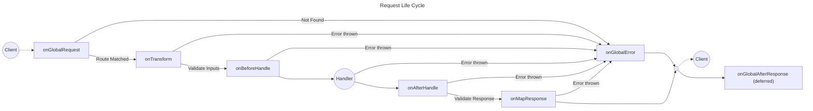

# Request Life Cycle

<br/>



[[toc]]

## Hook Types

There are two types of hooks: global and isolated.

- **Global**

   These hooks are registered on the final, top-level app, regardless of where they are defined on a top-level or child app. They always run for every request that hits the server. Use these for cross-cutting concerns like logging or authentication.

- **Isolated**

   These hooks only apply to routes defined on the _same app instance_, _after_ the hook is added. They are perfect for setting up context or running middleware specific to a group of routes (e.g., a [plugin](/composing-apps#plugins)).

## Hooks

### `onGlobalRequest`

Called as soon as a request is made to the app.


Return value is shallow merged into the `ctx` object for future callbacks.

### `onTransform`

Called before input parameters have been validated, can be used to transform input values before validation occurs.

Return value is shallow merged into the `ctx` object for future callbacks.

### `onBeforeHandle`

Called after inputs have been validated, right before the route handler is executed.

Return value is shallow merged into the `ctx` object for future callbacks.

### `onAfterHandle`

Called after the route handler is executed.

Return value replaces the value returned from the handler.

### `onMapResponse`

Convert the return value into a [`Response` object](https://developer.mozilla.org/en-US/docs/Web/API/Response).

If a `Response` value is returned, send it to the client.

If a `Response` value is not returned, Zeta infers the response content type based on the handler's response value.

### `onGlobalAfterResponse`

Called after the response is sent to the client.

Return value is ignored.

### `onGlobalError`

If an error is thrown at any point in the lifecycle, this hook will be called giving you the opportunity to report the error.

## Example

Here's an example combining several different hooks:

```ts
import { createApp } from "@aklinker1/zeta";
import { NotFoundHttpError } from "@aklinker1/zeta/errors";

const usersApp = createApp({ prefix: "/api/users" })
  .get("/", {}, () => {
    return [];
  })
  .onTransform(({ path }) => {
    return {
      path: {
        ...path,
        userId: Number(path.userId),
      },
    };
  })
  .onBeforeHandle(async ({ path }) => {
    const user = await getUser(path.userId);
    if (user == null) throw new NotFoundHttpError("User not found");

    return { user };
  })
  .get("/:userId", {}, async ({ user }) => user)
  .put("/:userId", {}, async ({ user }) => {
    // ...
  })
  .delete("/:userId", {}, async ({ user }) => {
    // ...
  });

const app = createApp()
  .onGlobalRequest(() => {
    return {
      startTime: performance.now(),
    };
  })
  .onGlobalAfterResponse(({ startTime }) => {
    const endTime = performance.now();
    console.log(`Request duration: ${endTime - startTime} ms`);
  })
  .use(apiApp);
```

## Utilities

### Decorate

Shorthand for `.onTransform(() => decorators)`, which just adds values to the request context.

```ts
const db = ...;
const redis = ...;

const app = createApp()
  .decorate("db", db)
  .decorate("redis", redis)
  // OR in a single call
  .decorate({ db, redis })

  // Then you can access the decorated values in the handler
  .get("/path", {}, ({ db, redis }) => {
    // ...
  })
```
